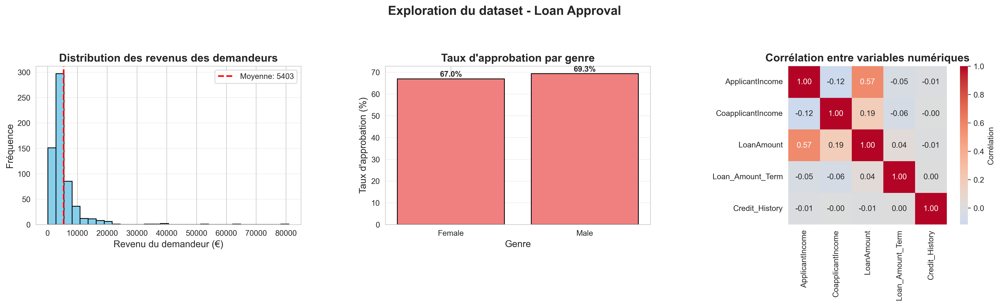

# Loan Approval Predictor

Application Streamlit de visualisation et de prediction pour l'approbation de prets bancaires.

## Description

Cette application permet d'explorer un jeu de donnees de demandes de pret, de simuler une nouvelle demande et d'obtenir une prediction d'approbation a partir de modeles de machine learning deja entraines.

Elle a ete preparee pour un deploiement simple sur GitHub et Streamlit Cloud avec une structure de projet propre, des chemins relatifs et des dependances explicites.

## Fonctionnalites

- Dashboard d'exploration des donnees
- Metriques globales sur les demandes de pret
- Histogrammes, boxplots, pie chart et heatmap de correlation
- Filtres interactifs pour l'analyse
- Interface de prediction d'une nouvelle demande
- Affichage de la probabilite associee a la decision
- Explication des facteurs influents selon le modele choisi
- Onglet de performance avec evaluation du modele

## Technologies

- Python 3.13
- Streamlit
- pandas
- numpy
- plotly
- scikit-learn
- joblib

## Structure du projet

- app.py : application Streamlit principale
- data/ : fichiers CSV utilises par l'application
- models/ : modeles et artefacts de preprocessing
- .streamlit/config.toml : configuration visuelle Streamlit
- requirements.txt : dependances Python exactes
- .gitignore : exclusions Git, y compris le fichier de secrets Streamlit

Tous les chargements utilisent des chemins relatifs compatibles avec GitHub et Streamlit Cloud.

## Installation locale

Prerequis :

- Python 3.13
- pip

Installation :

1. Cloner le repository.
2. Ouvrir un terminal dans le dossier du projet.
3. Installer les dependances :

   pip install -r requirements.txt

4. Lancer l'application :

   streamlit run app.py

5. Ouvrir l'URL locale affichee dans le terminal.

## Deploiement

### Deploiement sur Streamlit Cloud

1. Pousser le code sur GitHub.
2. Se connecter a Streamlit Cloud.
3. Creer une nouvelle application depuis le repository GitHub.
4. Selectionner la branche principale.
5. Indiquer app.py comme fichier principal.
6. Lancer le deploiement.

### Notes de deploiement

- Aucun chemin absolu n'est utilise dans l'application.
- Les donnees sont stockees dans data/.
- Les modeles sont stockes dans models/.
- Le fichier .streamlit/secrets.toml est ignore par Git.
- Si des secrets sont necessaires plus tard, ils doivent etre configures dans Streamlit Cloud et non commits dans le repository.

## Usage

1. Ouvrir l'onglet Exploration pour analyser les donnees.
2. Utiliser les filtres pour restreindre le jeu de donnees affiche.
3. Ouvrir l'onglet Prediction pour saisir les informations d'un demandeur.
4. Lancer la prediction pour obtenir la decision du modele.
5. Consulter la probabilite et les variables les plus influentes.
6. Ouvrir l'onglet Performance pour examiner les metriques du modele.

## Screenshots

### Apercu du projet

## Auteur

- hngngocnguyen

## License

Ce projet est distribue sous licence MIT. Voir le fichier LICENSE pour le texte complet.
